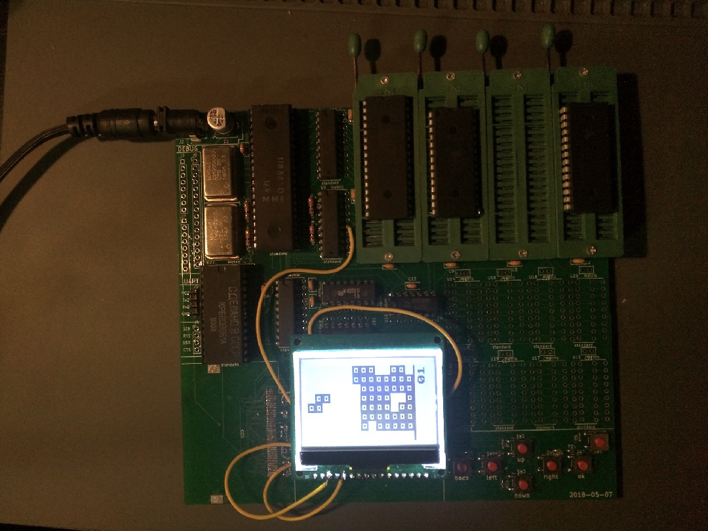

# computer

A microcomputer built from Soviet-era parts, developed for a History research project looking into technology behind the Iron Curtain.

The computer's design is based around a [U880](https://en.wikipedia.org/wiki/U880) processor, manufactured by the East German government. It has 8 KB of ROM and 4 KB of RAM. (unfortunately, the Soviet ROM and RAM parts I purchased didn't work, so the actual computer uses modern-day but functionally equivalent parts.) For input and output, it features a serial port, a 128x64 LCD display (a modern-day substitute for the bulky CRT monitors of the time, to make the computer easier to transport and use), and 6 buttons. These specifications, combined with the datecodes on the different parts, place the computer somewhere in the late 80s.

This repository serves as a place to link to the respositories for the different components involved in the computer's design and construction.

* [computer-hw](https:///github.com/thatoddmailbox/computer-hw): The electrical schematic and PCB layout files, in KiCad and PDF formats.
* [computer-fw](https://github.com/thatoddmailbox/computer-fw): The source code to the computer's firmware, written in Z80 assembly language.
* [computer-emu](https://github.com/thatoddmailbox/computer-emu): An emulator for the computer, written in Go, which allows you to test changes made to the code without needing to go through the annoying process of reprogramming the flash chips.
* [z80asm](https://github.com/thatoddmailbox/z80asm): A custom assembler for the computer, capable of producing Z80 machine code that works with the weird ROM layout of the system.
